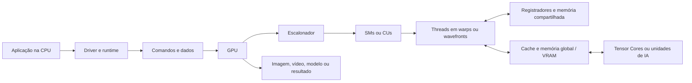

# 2. System Overview

## 2.1 General Description
Uma GPU é um processador paralelo formado por muitos núcleos menores e unidades especializadas. Ela recebe trabalhos da CPU, divide esses trabalhos em threads e executa milhares delas em grupos. Esse desenho é eficiente para operações repetitivas sobre grandes conjuntos de dados, como aplicar uma mesma fórmula a todos os pixels de uma imagem ou a todos os elementos de uma matriz.

Em uma aplicação moderna, CPU e GPU formam um sistema heterogêneo. A CPU executa o sistema operacional, controla o fluxo geral e inicia os kernels. A GPU executa os kernels, que são funções preparadas para rodar em paralelo. Em IA, os kernels realizam principalmente multiplicação de matrizes, convolução, normalização e funções de ativação.

## 2.2 Main Components

- **CPU (host):** coordena a aplicação, prepara os dados e envia comandos para a GPU.
- **Unidades de execução:** multiprocessadores de streaming (SMs, na NVIDIA) ou unidades de computação (CUs, na AMD). Cada unidade mantém grupos de threads ativos.
- **Núcleos de cálculo:** executam operações inteiras e de ponto flutuante. GPUs modernas também possuem unidades específicas para tensores e ray tracing.
- **Escalonador:** distribui blocos de threads para as unidades disponíveis e tenta manter o hardware ocupado.
- **Memória da GPU (global/VRAM):** tem grande largura de banda e armazena imagens, tensores, modelos e outros dados.
- **Caches e memória compartilhada:** reduzem o tempo de acesso aos dados reutilizados pelas threads.
- **Registradores:** memória muito rápida, normalmente privada de cada thread.
- **Interconexão e barramento:** conectam GPU, CPU e dispositivos. PCI Express é comum em placas dedicadas; NVLink e tecnologias semelhantes oferecem maior largura de banda em alguns sistemas.
- **Entrada e saída:** inclui tela, armazenamento, rede, câmera e outros dispositivos. Dados podem passar pela CPU ou por mecanismos de cópia direta, dependendo do sistema.

## 2.3 Block Diagram

O diagrama representa o caminho lógico. A organização física varia entre fabricantes e gerações.

## 2.4 Data Flow
1. A aplicação executada pela CPU reserva ou identifica os dados de entrada, como pixels, vértices, matrizes ou lotes de treinamento.
2. O driver e o runtime, como CUDA, HIP ou OpenCL, preparam a execução e transferem os dados para a memória acessível pela GPU.
3. A CPU inicia um kernel. O kernel é dividido em uma grade de blocos, e cada bloco contém várias threads.
4. O escalonador distribui os blocos entre SMs ou CUs. As threads são agrupadas em warps ou wavefronts e executam a mesma instrução sobre dados diferentes.
5. As threads usam registradores para valores temporários, memória compartilhada para dados reutilizados no bloco e memória global para dados maiores.
6. O resultado fica na memória da GPU e pode ser usado por outro kernel, exibido como imagem ou copiado de volta para a memória da CPU.

Em IA, esse fluxo se repete em várias camadas. Os dados entram como tensores, unidades especializadas executam operações matriciais e o resultado segue para a próxima camada. No treinamento, também são armazenados gradientes e pesos atualizados.

## 2.5 Main Characteristics

| Característica | Descrição |
|---|---|
| Paralelismo | Muitas threads executam operações semelhantes ao mesmo tempo. |
| Modelo de execução | SIMT: grupos de threads seguem a mesma instrução, embora possam trabalhar com dados diferentes. |
| Unidade de trabalho | Kernels são divididos em grids, blocos e threads. |
| Memória | Registradores são os mais rápidos; memória compartilhada é rápida e cooperativa; caches e VRAM têm maior capacidade. |
| Largura de banda | A VRAM foi projetada para movimentar grandes volumes de dados por segundo. |
| CPU e GPU | A CPU coordena tarefas sequenciais e a GPU acelera tarefas altamente paralelas. |
| Desvios condicionais | Muitos desvios diferentes dentro do mesmo grupo de threads podem reduzir o desempenho. |
| Sincronização | Threads do mesmo bloco podem sincronizar; sincronizações frequentes entre blocos são mais custosas. |
| IA | Tensor Cores ou equivalentes aceleram matrizes, convoluções e formatos de menor precisão. |
| Limitação principal | Transferir dados entre CPU e GPU e acessar a memória de forma inadequada pode eliminar o ganho do paralelismo. |

## 2.6 Paralelismo na Prática
O desempenho da GPU depende de manter muitas threads prontas para executar. Um kernel tende a ser eficiente quando possui bastante trabalho independente, acessos de memória organizados e pouca divergência entre threads do mesmo warp ou wavefront. Para isso, programadores normalmente:

- dividem o problema em blocos independentes;
- reutilizam dados por meio da memória compartilhada;
- organizam acessos consecutivos à memória para aproveitar a coalescência;
- reduzem transferências desnecessárias entre CPU e GPU;
- escolhem o tipo numérico adequado, como FP32, FP16, BF16 ou INT8.

Assim, ter mais núcleos não garante sozinho mais velocidade. O algoritmo e a forma como os dados percorrem a hierarquia de memória são tão importantes quanto o hardware.

## 2.7 Comunicação, Limitações e Impacto

Os componentes se comunicam por diferentes mecanismos, conforme o tipo de dado e a distância entre eles:

- **PCI Express (PCIe):** conecta uma GPU dedicada à placa-mãe e permite a troca de comandos e dados entre CPU, memória RAM e GPU.
- **NVLink ou interconexões equivalentes:** conectam GPUs entre si ou a outros componentes em sistemas de alto desempenho, oferecendo mais largura de banda que uma conexão PCIe comum.
- **DMA (Direct Memory Access):** permite transferir dados entre memória e dispositivos sem exigir que a CPU copie cada parte manualmente.
- **Barramento de memória:** liga a GPU à VRAM e determina, junto com a frequência e o tipo de memória, a quantidade de dados que pode ser movimentada por segundo.
- **Memória compartilhada, caches e sincronização:** permitem que threads troquem ou reutilizem dados dentro da GPU. Barreiras de sincronização controlam quando um grupo pode prosseguir.
- **Driver, runtime e comandos:** formam a interface de software pela qual a CPU configura kernels, aloca memória, inicia operações e consulta resultados.

Essa organização possui limitações. A transferência pelo PCIe pode ser muito mais lenta do que o processamento interno da GPU; por isso, transferências frequentes reduzem o ganho obtido com o paralelismo. A capacidade da VRAM também limita o tamanho dos modelos e dos conjuntos de dados. Além disso, acessos desorganizados à memória, divergência entre threads, excesso de sincronização e tarefas com dependências sequenciais diminuem a ocupação e o desempenho.

O impacto da comunicação é direto: quando os dados permanecem próximos das unidades de cálculo e são reutilizados por caches ou memória compartilhada, a GPU consegue manter muitas threads ocupadas. Quando os dados precisam atravessar repetidamente a CPU, a RAM e a GPU, o tempo de comunicação pode superar o tempo de cálculo. Portanto, o desempenho do sistema depende tanto da capacidade de processamento quanto da largura de banda, da latência e da forma como o software organiza os dados e os comandos.
